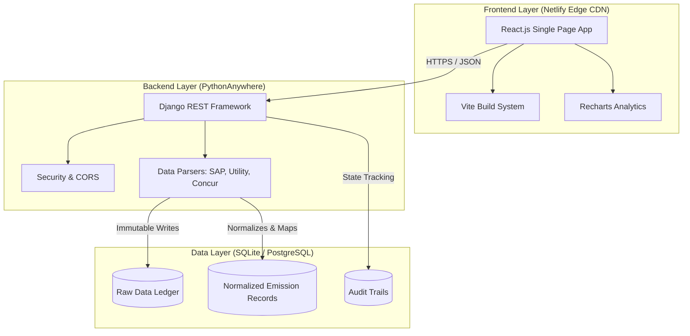

# Breathe ESG: Carbon Data Ingestion Engine


A production-ready prototype built to ingest, normalize, and audit complex, disparate carbon emission data from enterprise systems (SAP, Utilities, and Corporate Travel). 

**Live Demo:** [https://carbondataplatform.netlify.app/](https://carbondataplatform.netlify.app/)

---

## 🏗 System Architecture

The application uses a modern, decoupled architecture designed for high availability and strict data auditing. 



---

## ⚙️ The Ingestion Pipeline

The core challenge of this assessment was normalizing unstructured data. Instead of blindly trusting incoming CSVs, the system employs an **Immutable Ledger Pipeline**.

```mermaid
sequenceDiagram
    participant Analyst
    participant Django_API
    participant Parser
    participant Database

    Analyst->>Django_API: Uploads messy SAP CSV / API Payload
    Django_API->>Database: Saves exact raw bytes to `RawDataUpload` (Immutable)
    Django_API->>Parser: Sends payload for processing
    
    rect rgb(30, 41, 59)
    note right of Parser: Normalization Engine
    Parser-->>Parser: Maps German columns (Menge -> Quantity)
    Parser-->>Parser: Converts units (Gallons -> Liters)
    Parser-->>Parser: Multiplies by `EmissionFactor`
    end
    
    Parser->>Database: Creates `NormalizedEmissionRecord` (Status: PENDING)
    
    Analyst->>Django_API: Edits quantity or approves row
    Django_API->>Database: Logs exact diff in `AuditLog`
```



---

## 📂 Project Structure & Deliverables

This repository strictly adheres to the requested deliverables. Please refer to the specific markdown documents for deep-dives into the engineering decisions:

1. [**`MODEL.md`**](./MODEL.md): Explains the schema, the rationale behind the `RawDataUpload` ledger, and the multi-tenant design.
2. [**`DECISIONS.md`**](./DECISIONS.md): Details the specific edge-cases chosen for SAP (German headers) and Utilities (rolling meter deltas).
3. [**`TRADEOFFS.md`**](./TRADEOFFS.md): Discusses omitted features like Celery Queues and real IATA geolocation.
4. [**`SOURCES.md`**](./SOURCES.md): Analyzes real-world quirks in SAP ALV exports and the Concur Itinerary API.

### Core Technologies
* **Frontend:** React, Vite, Recharts, Lucide Icons. Pure CSS (Glassmorphism design system).
* **Backend:** Python, Django 5, Django REST Framework.
* **Deployment:** Vercel/Netlify (Static Frontend) + PythonAnywhere (Backend WSGI).

---

## 🚀 Running Locally

If you wish to spin up the 2,000 auto-generated database records locally:

### 1. Start the Backend
```bash
# Clone the repository
git clone https://github.com/mukulgupta11/carbon-data-pipeline.git
cd carbon-data-pipeline

# Setup Virtual Environment
python -m venv venv
source venv/bin/activate  # On Windows: .\venv\Scripts\activate

# Install dependencies and seed the massive dataset
pip install -r requirements.txt
python manage.py migrate
python setup_db.py

# Run the server
python manage.py runserver
```

### 2. Start the Frontend
```bash
# Open a new terminal tab
cd frontend
npm install
npm run dev
```

The frontend will start at `http://localhost:5173` and will automatically connect to your local Django server on port 8000.
